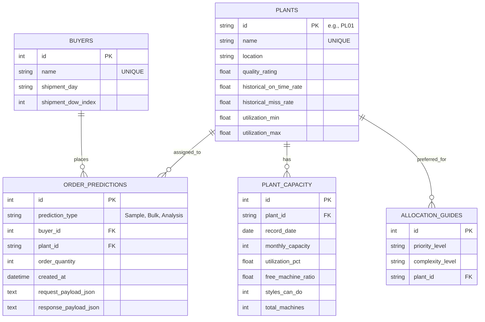

# Garment Production System — Database Architecture

This document outlines the proposed SQLite database schema to replace the hardcoded dictionaries and Excel-based capacity files currently used across Components 1, 2, 3, and 4. 

Migrating to a database will make the system more dynamic, easier to update, and remove the need to redeploy the code when factory metrics or capacities change.

## Entity-Relationship (ER) Diagram

---

## Table Schemas

### 1. `buyers`
Stores information about the buyers and their specific shipment schedules.
*   **Replaces:** `BUYER_SHIPMENT_SCHEDULE`, `BUYER_DOW` in `component1.py`.

| Column | Type | Constraints | Description |
| :--- | :--- | :--- | :--- |
| `id` | INTEGER | PRIMARY KEY, AUTOINCREMENT | Unique ID |
| `name` | TEXT | UNIQUE, NOT NULL | Buyer Name (e.g., 'George', 'Tesco') |
| `shipment_day` | TEXT | NOT NULL | Day of week (e.g., 'Thursday') |
| `shipment_dow_index` | INTEGER | NOT NULL | Integer representation (e.g., 3) |

### 2. `plants`
Stores static factory information, quality ratings, and historical performance metrics.
*   **Replaces:** `PLANT_QUALITY`, `PLANT_LOCATIONS`, `PLANT_ONTIME_RATES`, `PLANT_UTIL_RANGE`, `PLANT_NAME_TO_ID`, `PLANT_KPI`, `hist_miss`.

| Column | Type | Constraints | Description |
| :--- | :--- | :--- | :--- |
| `id` | TEXT | PRIMARY KEY | Plant ID (e.g., 'PL01') |
| `name` | TEXT | UNIQUE, NOT NULL | Factory Name (e.g., 'Dinusha Embroidery') |
| `location` | TEXT | | Geographic location |
| `quality_rating` | REAL | | Average quality (e.g., 4.8) |
| `historical_on_time_rate` | REAL | | (e.g., 0.90) |
| `historical_miss_rate` | REAL | | (e.g., 0.10) |
| `utilization_min` | REAL | | Lowest historical utilization (for C1 calculations) |
| `utilization_max` | REAL | | Highest historical utilization |

### 3. `plant_capacity`
A time-series table to replace the `capacity_full_year_2024.xlsx` file. This allows the APIs to query the live/historical capacity without loading an entire excel file into memory.
*   **Replaces:** Excel sheet loading in Component 1 (`_load_capacity()`).

| Column | Type | Constraints | Description |
| :--- | :--- | :--- | :--- |
| `id` | INTEGER | PRIMARY KEY, AUTOINCREMENT | Unique ID |
| `plant_id` | TEXT | FOREIGN KEY (`plants.id`) | Links to the specific plant |
| `record_date` | DATE | NOT NULL | The date this capacity applies to |
| `monthly_capacity` | INTEGER | | Max items per month |
| `utilization_pct` | REAL | | Current utilization percentage |
| `free_machine_ratio` | REAL | | Ratio of free machines |
| `styles_can_do` | INTEGER | | Number of styles they can handle concurrently |
| `total_machines` | INTEGER | | Total machines available |

> [!TIP]
> **Performance:** Add a composite index on `(plant_id, record_date)` to make querying the "nearest date" fast when Component 1 is looking up live capacity.

### 4. `allocation_guides`
Stores the rules for which plants are preferred based on order priority and complexity.
*   **Replaces:** `ALLOCATION_GUIDE` dict in `component2.py`.

| Column | Type | Constraints | Description |
| :--- | :--- | :--- | :--- |
| `id` | INTEGER | PRIMARY KEY, AUTOINCREMENT | Unique ID |
| `priority_level` | TEXT | NOT NULL | 'High', 'Normal', 'Low', 'No Urgency' |
| `complexity_level` | TEXT | NOT NULL | 'Hard', 'High', 'Medium', 'Low' |
| `plant_id` | TEXT | FOREIGN KEY (`plants.id`) | The preferred plant for this combo |

### 5. `order_predictions` (Logging for ML Retraining)
*Optional but Highly Recommended.*
Instead of throwing away the data after predicting, save the JSON request and response payloads. This creates a feedback loop so you can periodically extract this data to retrain your ML models in the future.

| Column | Type | Constraints | Description |
| :--- | :--- | :--- | :--- |
| `id` | INTEGER | PRIMARY KEY, AUTOINCREMENT | Unique ID |
| `prediction_type` | TEXT | NOT NULL | 'Component 1', 'Component 2', 'Component 4' |
| `buyer_id` | INTEGER | FOREIGN KEY (`buyers.id`) | Optional |
| `plant_id` | TEXT | FOREIGN KEY (`plants.id`) | Assigned/Target Plant |
| `order_quantity` | INTEGER | | Quantity processed |
| `created_at` | DATETIME | DEFAULT CURRENT_TIMESTAMP | When the API was called |
| `request_payload_json` | TEXT | | Full JSON input |
| `response_payload_json`| TEXT | | Full JSON output |

---

## Migration Strategy
1. **Initialize DB:** Write a python script using `sqlite3` to create these tables.
2. **Seed Data:** 
   - Write a migration script that parses `component1.py`, `component2.py`, and `component4.py` dictionaries, inserting the data into `buyers`, `plants`, and `allocation_guides`.
   - Use `pandas` to read `models/capacity_full_year_2024.xlsx` and bulk insert into `plant_capacity`.
3. **Refactor APIs:** Update the Flask endpoints to use `sqlite3` or an ORM like `SQLAlchemy` to fetch this data instead of using the hardcoded variables.
