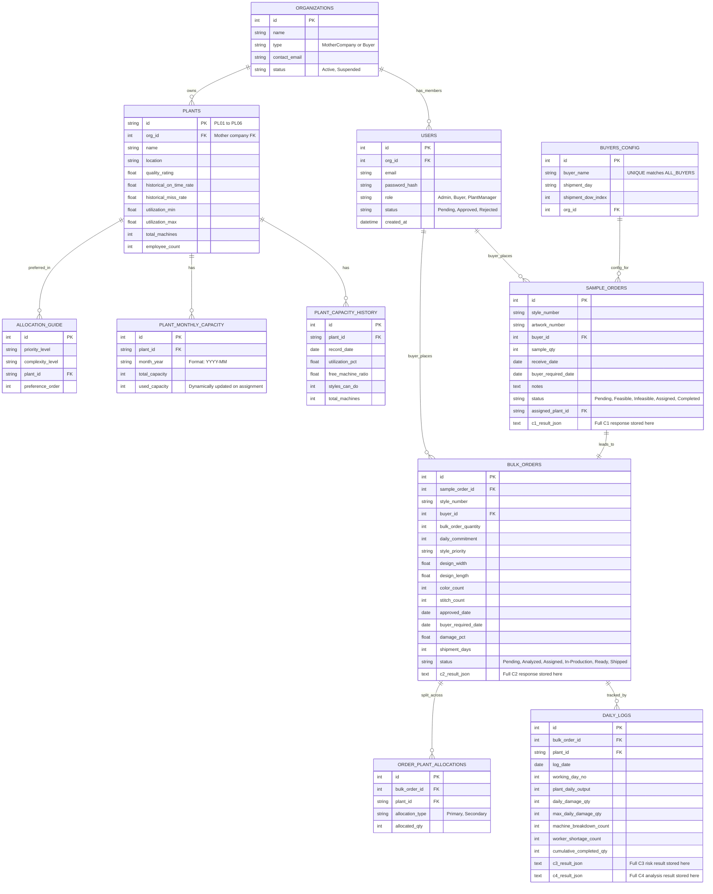

# Garment Production System — Full Implementation Plan

## 1. Background & Goal

Transform the existing 4-component ML prediction system into a full-stack, stateful Garment Production Management application with:
- Role-based logins (Admin / Buyer / Plant Manager)
- Complete order lifecycle tracking (Sample → Bulk → Production → Delivery)
- Real-time capacity management
- Automated email notifications

---

## 2. Model & Dataset Compatibility Audit

Before touching any code, here is what exists and what the DB must mirror exactly.

### Component 1 — Sample Planning
- **Inputs from request:** `buyer_name`, `style_id`, `sample_qty`, `receive_date`, `buyer_required_date`
- **Hardcoded data to migrate to DB:** `BUYER_SHIPMENT_SCHEDULE`, `BUYER_DOW`, `PLANT_QUALITY`, `PLANT_LOCATIONS`, `PLANT_ONTIME_RATES`, `PLANT_UTIL_RANGE`, `QTY_COMPLETION_MAP`
- **Excel file to migrate:** `capacity_full_year_2024.xlsx` + `capacity_full_year_2026.xlsx` → `plant_capacity` table
- **Models loaded:** `m3_delay_classifier.pkl`, `le_buyer.pkl`, `le_priority.pkl`

### Component 2 — Bulk Order Planning
- **Inputs from request:** `buyer_name`, `bulk_order_quantity`, `daily_commitment`, `style_priority`, `design_width`, `design_length`, `color_count`, `stitch_count`, `sample_plant`, `sp_cap_util_pct`, `bulk_order_approved_date`, `monthly_capacity` (dict)
- **Hardcoded data to migrate to DB:** `QUALITY_MAP`, `ALLOCATION_GUIDE`, `PRIORITY_ENC`, `BUYER_ENC`
- **Models loaded:** `c2_model_cutting.pkl`, `c2_model_sewing.pkl`, `c2_model_embroidery.pkl`, `c2_model_allocation.pkl`, `c2_model_deadline.pkl`
- **Note:** `monthly_capacity` dict is currently provided in the request body — after migration, the system will read this **from the DB** automatically

### Component 3 — Emergency Detection (Daily Monitoring)
- **Inputs from request:** `bulk_order_id`, `style_id`, `buyer_name`, `allocated_bulk_plant`, `full_order_qty`, `daily_commitment`, `production_date`, `working_day_no`, `plant_daily_output`, `daily_damage_qty`, `machine_breakdown_count`, `worker_shortage_count`, `cumulative_completed_qty`
- **This is called daily during production** — maps naturally to a `daily_logs` table
- **Models loaded:** `c3_model1_risk_type.pkl`, `c3_model2_order_risk.pkl`

### Component 4 — Production Analysis
- **Inputs from request:** `plant_name`, `order_quantity`, `planned_completion_days`, `actual_completion_days`, `machine_count`, `active_machine_count`, `employee_count`, `daily_output_avg`, `total_workload`, `urgent_style_flag`, `urgent_handled_count`, `risk_count_from_component3`, `machine_breakdown_days`, `worker_shortage_days`, `damage_rate`
- **Hardcoded data to migrate to DB:** `PLANT_NAME_TO_ID`, `PLANT_KPI`
- **Key link:** `risk_count_from_component3` is an **aggregated count** of risk events from Component 3 daily logs — the DB will compute this automatically
- **Models loaded:** `model_A_perf_regressor.pkl`, `model_B_star_classifier.pkl`, `model_D_best_plant.pkl`, `model_E_multilabel_recommendation.pkl`, `scaler.pkl`, `encoders.pkl`

---

## 3. Database Architecture (Final — Verified Against All Models)



---

## 4. Full System Workflow (End-to-End)

```
PHASE 1 ─ ONBOARDING
┌──────────────────────────────────────────────────────────────────────────┐
│  Buyer Company registers → status = Pending                              │
│  Admin approves → status = Approved, Buyer can now log in                │
│  Plant managers have pre-seeded accounts (one per plant, no new creation)│
└──────────────────────────────────────────────────────────────────────────┘

PHASE 2 ─ SAMPLE ORDER (Component 1)
┌──────────────────────────────────────────────────────────────────────────┐
│  Buyer submits: artwork_number, style_number, sample_qty,                │
│                 receive_date, buyer_required_date, notes                  │
│  System pulls buyer shipment schedule from DB (BUYERS_CONFIG table)      │
│  System pulls live plant capacity from DB (PLANT_CAPACITY_HISTORY)       │
│  → Component 1 runs → returns feasibility, risk, plant rankings          │
│  C1 result JSON saved to sample_orders.c1_result_json                    │
│  Admin reviews → assigns best plant                                       │
│  → PLANT_MONTHLY_CAPACITY.used_capacity += sample_qty for that month     │
│  status → "Assigned"                                                     │
└──────────────────────────────────────────────────────────────────────────┘

PHASE 3 ─ BULK ORDER (Component 2)
┌──────────────────────────────────────────────────────────────────────────┐
│  Buyer submits bulk order (linked to sample_order_id)                    │
│  System reads monthly_capacity for all plants from DB automatically      │
│  → Component 2 runs → returns production days, allocation type,          │
│     deadline match, ranked plant recommendations                          │
│  C2 result JSON saved to bulk_orders.c2_result_json                      │
│  Admin assigns plant(s) → ORDER_PLANT_ALLOCATIONS rows created           │
│  → PLANT_MONTHLY_CAPACITY.used_capacity updated for all assigned plants  │
│  status → "Assigned" → "In-Production"                                   │
└──────────────────────────────────────────────────────────────────────────┘

PHASE 4 ─ DAILY MONITORING (Component 3 + Component 4)
┌──────────────────────────────────────────────────────────────────────────┐
│  EACH DAY, Plant Manager logs in and submits:                            │
│    plant_daily_output, daily_damage_qty, machine_breakdown_count,        │
│    worker_shortage_count, cumulative_completed_qty                       │
│  System auto-derives: working_day_no, remaining_qty, days_remaining      │
│  → Component 3 runs → risk_type, severity, recommendation saved to log  │
│                                                                          │
│  At end of bulk order (or weekly):                                       │
│  System aggregates all C3 logs → risk_count_from_component3              │
│  → Component 4 runs → performance score (1–5★), recommendations         │
│  C4 result saved to daily_logs.c4_result_json                           │
└──────────────────────────────────────────────────────────────────────────┘

PHASE 5 ─ COMPLETION & NOTIFICATION
┌──────────────────────────────────────────────────────────────────────────┐
│  Plant Manager marks order as "Ready"                                    │
│  → Email sent to Buyer: "Your order #XYZ is ready for shipment!"         │
│  Admin confirms shipment → status → "Shipped"                            │
└──────────────────────────────────────────────────────────────────────────┘
```

---

## 5. Proposed File Structure

```
garment_new/
├── app.py
├── components/          (existing — no changes)
│   ├── component1.py
│   ├── component2.py
│   ├── component3.py
│   └── component4.py
├── database/            (NEW)
│   ├── db.py            → SQLite connection helper & init
│   ├── models.py        → Table schema definitions (CREATE TABLE SQL)
│   └── seed.py          → Migration script (dicts + Excel → DB)
├── routes/              (NEW)
│   ├── auth.py          → /auth/register, /auth/login, /auth/approve
│   ├── orders.py        → /orders/sample, /orders/bulk, /orders/<id>/assign
│   ├── production.py    → /production/log, /production/<id>/ready
│   └── admin.py         → /admin/users, /admin/capacity
├── services/            (NEW)
│   ├── email_service.py → send_email() utility
│   └── capacity.py      → deduct_capacity(), get_available_capacity()
├── models/              (existing — ML .pkl files, no changes)
└── requirements.txt
```

---

## 6. Proposed New DB Tables (SQL)

```sql
-- Organizations (Mother Company + Buyer Companies)
CREATE TABLE organizations (
    id INTEGER PRIMARY KEY AUTOINCREMENT,
    name TEXT UNIQUE NOT NULL,
    type TEXT NOT NULL CHECK(type IN ('MotherCompany', 'Buyer')),
    contact_email TEXT,
    status TEXT DEFAULT 'Active'
);

-- Users (Admin, Buyers, Plant Managers)
CREATE TABLE users (
    id INTEGER PRIMARY KEY AUTOINCREMENT,
    org_id INTEGER NOT NULL REFERENCES organizations(id),
    email TEXT UNIQUE NOT NULL,
    password_hash TEXT NOT NULL,
    role TEXT NOT NULL CHECK(role IN ('Admin', 'Buyer', 'PlantManager')),
    status TEXT DEFAULT 'Pending' CHECK(status IN ('Pending', 'Approved', 'Rejected')),
    created_at DATETIME DEFAULT CURRENT_TIMESTAMP
);

-- Plants (Pre-seeded, linked to mother company)
CREATE TABLE plants (
    id TEXT PRIMARY KEY,               -- PL01..PL06
    org_id INTEGER REFERENCES organizations(id),  -- mother company
    name TEXT UNIQUE NOT NULL,
    location TEXT,
    quality_rating REAL,
    historical_on_time_rate REAL,
    historical_miss_rate REAL,
    utilization_min REAL,
    utilization_max REAL,
    total_machines INTEGER,
    employee_count INTEGER
);

-- Buyer shipment config (replaces BUYER_SHIPMENT_SCHEDULE / BUYER_DOW in C1)
CREATE TABLE buyers_config (
    id INTEGER PRIMARY KEY AUTOINCREMENT,
    org_id INTEGER REFERENCES organizations(id),
    buyer_name TEXT UNIQUE NOT NULL,
    shipment_day TEXT NOT NULL,
    shipment_dow_index INTEGER NOT NULL
);

-- Capacity history from Excel (replaces capacity_full_year_2024/2026.xlsx)
CREATE TABLE plant_capacity_history (
    id INTEGER PRIMARY KEY AUTOINCREMENT,
    plant_id TEXT NOT NULL REFERENCES plants(id),
    record_date DATE NOT NULL,
    utilization_pct REAL,
    free_machine_ratio REAL,
    styles_can_do INTEGER,
    total_machines INTEGER
);
CREATE UNIQUE INDEX idx_plant_cap ON plant_capacity_history(plant_id, record_date);

-- Live monthly capacity (updated dynamically when orders assigned)
CREATE TABLE plant_monthly_capacity (
    id INTEGER PRIMARY KEY AUTOINCREMENT,
    plant_id TEXT NOT NULL REFERENCES plants(id),
    month_year TEXT NOT NULL,           -- e.g. '2025-03'
    total_capacity INTEGER NOT NULL,
    used_capacity INTEGER DEFAULT 0
);
CREATE UNIQUE INDEX idx_monthly ON plant_monthly_capacity(plant_id, month_year);

-- Allocation guide (replaces ALLOCATION_GUIDE dict in C2)
CREATE TABLE allocation_guide (
    id INTEGER PRIMARY KEY AUTOINCREMENT,
    priority_level TEXT NOT NULL,
    complexity_level TEXT NOT NULL,
    plant_id TEXT NOT NULL REFERENCES plants(id),
    preference_order INTEGER DEFAULT 1
);

-- Sample Orders (C1)
CREATE TABLE sample_orders (
    id INTEGER PRIMARY KEY AUTOINCREMENT,
    style_number TEXT NOT NULL,
    artwork_number TEXT,
    buyer_id INTEGER NOT NULL REFERENCES users(id),
    sample_qty INTEGER NOT NULL,
    receive_date DATE NOT NULL,
    buyer_required_date DATE NOT NULL,
    notes TEXT,
    status TEXT DEFAULT 'Pending',
    assigned_plant_id TEXT REFERENCES plants(id),
    c1_result_json TEXT,
    created_at DATETIME DEFAULT CURRENT_TIMESTAMP
);

-- Bulk Orders (C2)
CREATE TABLE bulk_orders (
    id INTEGER PRIMARY KEY AUTOINCREMENT,
    sample_order_id INTEGER REFERENCES sample_orders(id),
    style_number TEXT NOT NULL,
    buyer_id INTEGER NOT NULL REFERENCES users(id),
    bulk_order_quantity INTEGER NOT NULL,
    daily_commitment INTEGER NOT NULL,
    style_priority TEXT NOT NULL,
    design_width REAL,
    design_length REAL,
    color_count INTEGER,
    stitch_count INTEGER,
    approved_date DATE NOT NULL,
    buyer_required_date DATE NOT NULL,
    damage_pct REAL DEFAULT 0.0,
    shipment_days INTEGER DEFAULT 18,
    status TEXT DEFAULT 'Pending',
    c2_result_json TEXT,
    created_at DATETIME DEFAULT CURRENT_TIMESTAMP
);

-- Plant allocations per bulk order (for split orders)
CREATE TABLE order_plant_allocations (
    id INTEGER PRIMARY KEY AUTOINCREMENT,
    bulk_order_id INTEGER NOT NULL REFERENCES bulk_orders(id),
    plant_id TEXT NOT NULL REFERENCES plants(id),
    allocation_type TEXT DEFAULT 'Primary',
    allocated_qty INTEGER
);

-- Daily production logs (C3 runs per log; C4 aggregates across logs)
CREATE TABLE daily_logs (
    id INTEGER PRIMARY KEY AUTOINCREMENT,
    bulk_order_id INTEGER NOT NULL REFERENCES bulk_orders(id),
    plant_id TEXT NOT NULL REFERENCES plants(id),
    log_date DATE NOT NULL,
    working_day_no INTEGER NOT NULL,
    plant_daily_output INTEGER,
    daily_damage_qty INTEGER,
    max_daily_damage_qty INTEGER,
    machine_breakdown_count INTEGER DEFAULT 0,
    worker_shortage_count INTEGER DEFAULT 0,
    cumulative_completed_qty INTEGER,
    c3_result_json TEXT,
    c4_result_json TEXT,
    created_at DATETIME DEFAULT CURRENT_TIMESTAMP
);
```

---

## 7. Seed Data (One-Time Migration)

### Seed `plants` table from existing code constants:
| plant_id | name | location | quality_rating | on_time_rate | miss_rate |
|:---|:---|:---|:---|:---|:---|
| PL01 | Dinusha Embroidery | Weliweriya | 4.8 | 0.92 | 0.10 |
| PL02 | MRC Group | Colombo | 4.5 | 0.88 | 0.15 |
| PL03 | The Bobbin Group | Mount Lavinia | 4.4 | 0.85 | 0.13 |
| PL04 | Sunrose Lanka (Pvt) Ltd | Katubedda | 4.3 | 0.83 | 0.14 |
| PL05 | Regal Image International | Maharagama | 4.6 | 0.80 | 0.12 |
| PL06 | Amsral Lanka Enterprises | Boralesgamuwa | 4.2 | 0.78 | 0.16 |

> [!NOTE]
> The `utilization_min/max` values come from `PLANT_UTIL_RANGE` in `component1.py`. The `on_time_rate`/`quality_rating` come from `PLANT_KPI` in `component4.py`. All values are consistent across components and can be seeded directly.

### Seed `plant_capacity_history` from Excel:
- Run `pandas.read_excel("models/capacity_full_year_2024.xlsx")` and `2026.xlsx`
- Insert all rows into `plant_capacity_history` via bulk INSERT

### Seed `buyers_config` from `component1.py`:
| buyer_name | shipment_day | dow_index |
|:---|:---|:---|
| Tesco | Monday | 0 |
| M&S | Monday | 0 |
| George | Thursday | 3 |
| Hirdaramani | Thursday | 3 |

---

## 8. Key Integration Points (Model Compatibility)

| Component | What changes | How DB helps |
|:---|:---|:---|
| C1 | `_load_capacity()` reads Excel | → Query `plant_capacity_history` by `plant_id` and `record_date` instead |
| C1 | Buyer DOW lookup from dict | → Query `buyers_config` by `buyer_name` |
| C2 | `monthly_capacity` dict from request body | → Auto-read `plant_monthly_capacity` from DB, no need to send in request |
| C2 | Plant quality from `QUALITY_MAP` | → Query `plants.quality_rating` |
| C3 | `working_day_no` manually tracked | → Auto-derived from `daily_logs` count for this `bulk_order_id` |
| C4 | `risk_count_from_component3` manually provided | → `SELECT COUNT(*) FROM daily_logs WHERE bulk_order_id = X AND c3_result_json LIKE '%"severity": "Critical"%'` |
| C4 | `PLANT_KPI` hardcoded | → Query `plants.historical_on_time_rate` and `plants.quality_rating` |

> [!IMPORTANT]
> **None of the ML model `.pkl` files need to change.** The DB only replaces the hardcoded dictionaries and Excel files that feed data INTO the components. The feature vectors passed to the models remain identical.

---

## 9. Implementation Steps (Ordered)

- `[ ]` **Step 1 — DB Setup:** Create `database/db.py` with `init_db()` and `get_db()` helpers
- `[ ]` **Step 2 — Schema:** Create `database/models.py` with all CREATE TABLE SQL
- `[ ]` **Step 3 — Seed Script:** Write `database/seed.py` to populate `plants`, `buyers_config`, `allocation_guide`, and bulk-import both Excel files into `plant_capacity_history`
- `[ ]` **Step 4 — Auth Routes:** Build `/auth/register`, `/auth/login` (JWT tokens), `/auth/admin/approve/<user_id>`
- `[ ]` **Step 5 — Refactor C1 integration:** Update `_load_capacity()` and buyer DOW lookups in `component1.py` to query DB instead of hardcoded dicts
- `[ ]` **Step 6 — Sample Order Route:** Build `POST /orders/sample` — validates buyer, runs C1, saves result, returns feasibility
- `[ ]` **Step 7 — Admin Assignment Route:** Build `POST /orders/sample/<id>/assign` — Admin picks plant, updates `plant_monthly_capacity.used_capacity`
- `[ ]` **Step 8 — Refactor C2 integration:** Auto-read `monthly_capacity` from DB; remove it from the request body
- `[ ]` **Step 9 — Bulk Order Route:** Build `POST /orders/bulk` — validates, runs C2, saves result
- `[ ]` **Step 10 — Capacity Deduction:** On bulk order assignment, update `plant_monthly_capacity` for allocated plants
- `[ ]` **Step 11 — Daily Log Route:** Build `POST /production/log` — Plant Manager submits daily data → runs C3 → saves result
- `[ ]` **Step 12 — C4 Aggregation Route:** Build `GET /production/<bulk_order_id>/analysis` — aggregates logs → runs C4
- `[ ]` **Step 13 — Mark Ready Route:** `POST /production/<bulk_order_id>/ready` — changes status + triggers email
- `[ ]` **Step 14 — Email Service:** Build `services/email_service.py` with SMTP-based `send_order_ready_email(buyer_email, style_number)`
- `[ ]` **Step 15 — Admin Dashboard Endpoints:** Endpoints to view all orders, plant utilization, and C4 performance scores

---

## 10. Open Questions

> [!IMPORTANT]
> Please confirm the following before we start building:
> 1. **Frontend:** Is a web frontend (React/HTML) needed now, or just the REST APIs first?
> 2. **Email provider:** Use Gmail SMTP for now (testing) or a service like SendGrid?
> 3. **Authentication:** Use simple JWT tokens stored in the DB, or does this need a more complex session management?
> 4. **Mother Company name:** What is the name of the mother company to pre-seed into the `organizations` table?
